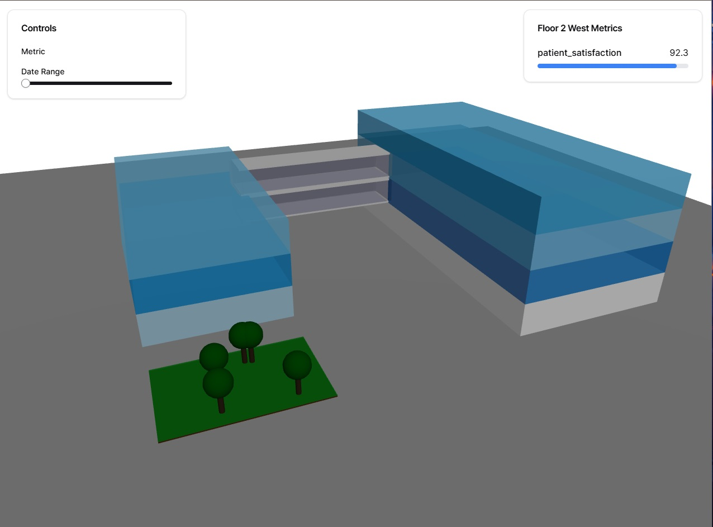

# Hospital 3D Metrics Visualization

A 3D visualization dashboard for hospital metrics using React Three Fiber and FastAPI. This project provides an interactive 3D representation of hospital buildings with real-time metrics visualization.



## Project Overview

This application visualizes hospital metrics across different floors and buildings in a 3D environment, allowing for intuitive data exploration and comparison. The visualization includes:
- Two main buildings (East and West)
- Connected bridges
- Garden area
- Interactive floor selection with hover states
- Real-time metrics display
- Heat map visualization of metrics
- Exploded floor view with detailed room layouts

### Building Layout
- West Building: 4 floors (1 West - 4 West)
- East Building: 3 floors (1 East - 3 East)
- Connected bridges between buildings
- Adjacent garden area

### Current Features

#### 1. Authentication System
- Secure user authentication with JWT tokens
- Role-based access control (Admin, Staff, User)
- User registration with email verification
- Password reset functionality
- Session management with token blacklisting
- Secure logout process
- Profile management for each user role

#### 2. Main Hospital View
- 3D visualization of hospital buildings
- Interactive floor selection with hover states
- Heat map visualization for selected metrics
- Free camera control for building exploration
- Collapsible controls panel
- Hover-activated metrics display
- Separate visualization controls for floor and room metrics

#### 3. Floor Detail View
- Exploded view showing detailed room layout
- Patient rooms arranged in two rows
- Therapy rooms and offices with distinct layouts
- Initial top-down perspective with free camera control
- Persistent metrics panel with "Back to Overview" option
- Heat map visualization at room level
- Room-specific metrics visualization with color coding
- Smooth transitions between views

#### 4. Metrics System
- Real-time metrics updates
- Floor-level metrics (occupancy, staff ratio, etc.)
- Room-level metrics (patient satisfaction, fall risk, etc.)
- Customizable color schemes for visualization
- Metric grouping by category (Patient, Staff, Room)
- Dynamic filtering based on metric type and category
- Automatic unit formatting based on metric type

#### 5. UI/UX Features
- Collapsible control panel
- Context-sensitive metrics display
- Smooth transitions between views
- Persistent metrics in detail view
- Responsive hover states
- Clean, uncluttered interface
- Role-specific navigation
- Error handling with user feedback

### Current Status and Next Steps

#### Backend Status
1. **Authentication & Authorization**
   - ✓ JWT-based authentication implemented
   - ✓ Token blacklisting for secure logout
   - ✓ Role-based access control
   - ✓ User registration and profile management

2. **API Endpoints**
   - ✓ Metrics endpoints with proper authentication
   - ✓ Floor and room metrics endpoints
   - ✓ Category-based filtering
   - ✓ User management endpoints

3. **Data Models**
   - ✓ User model with roles
   - ✓ Floor metrics model
   - ✓ Room metrics model
   - ✓ Metric definitions model

4. **Next Backend Tasks**
   - [ ] Update datetime handling to use timezone-aware objects
   - [ ] Update Pydantic schemas to V2 syntax
   - [ ] Add more comprehensive test coverage
   - [ ] Implement metric aggregation endpoints
   - [ ] Add data validation and sanitization
   - [ ] Implement caching for frequently accessed metrics

#### Frontend Status
1. **3D Visualization**
   - ✓ Basic hospital building structure
   - ✓ Interactive floor selection
   - ✓ Heat map visualization
   - [ ] Room-level detail view needs improvement

2. **UI Components**
   - ✓ Metrics control panel
   - ✓ Navigation controls
   - ✓ Authentication forms
   - [ ] Advanced filtering options needed

3. **Next Frontend Tasks**
   - [ ] Improve room layout rendering
   - [ ] Add comparison mode between floors
   - [ ] Implement date range filtering
   - [ ] Add more interactive elements to rooms
   - [ ] Enhance metric visualization options

### Known Issues
1. **Backend**
   - Deprecated datetime.utcnow() usage needs updating
   - Some API endpoints return 404 for empty results
   - Test coverage needs improvement
   - Schema validation needs updating to Pydantic V2

2. **Frontend**
   - Floor detail view layout needs improvement
   - Some room-level metrics may not display correctly
   - Camera controls need fine-tuning
   - Performance optimization needed for large datasets

## Project Structure
```
hospital-3d-metrics/
├── frontend/                 # React + Three.js frontend
│   ├── src/
│   │   ├── components/      # React components
│   │   ├── hooks/          # Custom React hooks
│   │   ├── services/       # API services
│   │   └── utils/          # Utility functions
├── backend/                 # FastAPI backend
│   ├── app/
│   │   ├── core/           # Core functionality
│   │   ├── models/         # Database models
│   │   ├── routes/         # API routes
│   │   ├── schemas/        # Pydantic schemas
│   │   └── services/       # Business logic
│   └── tests/              # Test suite
```

## Getting Started

### Prerequisites
- Python 3.8+
- Node.js 16+
- PostgreSQL 13+

### Backend Setup
1. Create a virtual environment:
```bash
python -m venv venv
source venv/bin/activate  # On Windows: venv\Scripts\activate
```

2. Install dependencies:
```bash
cd backend
pip install -r requirements.txt
```

3. Set up environment variables:
```bash
cp .env.example .env
# Edit .env with your database credentials and secret key
```

4. Run migrations:
```bash
alembic upgrade head
```

5. Start the server:
```bash
uvicorn app.main:app --reload
```

### Frontend Setup
1. Install dependencies:
```bash
cd frontend
npm install
```

2. Set up environment variables:
```bash
cp .env.example .env
# Edit .env with your API URL
```

3. Start the development server:
```bash
npm run dev
```

## Contributing
Please read CONTRIBUTING.md for details on our code of conduct and the process for submitting pull requests.