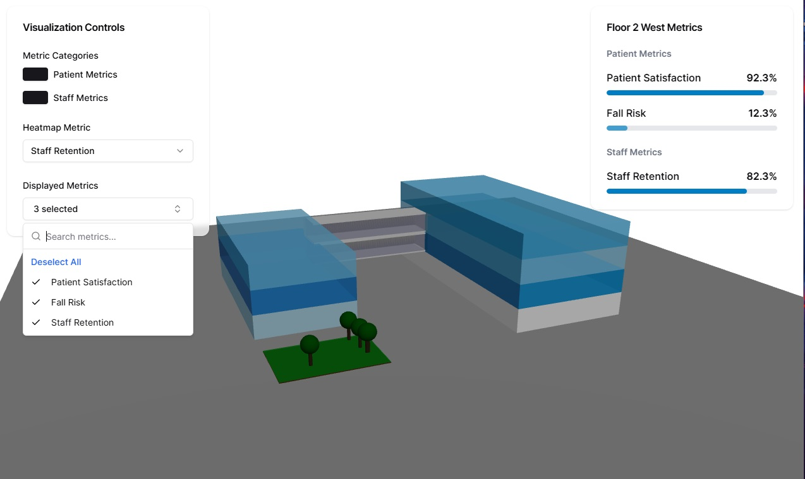

# Hospital 3D Metrics Visualization

A 3D visualization dashboard for hospital metrics using React Three Fiber and FastAPI. This project provides an interactive 3D representation of hospital buildings with real-time metrics visualization.



## Project Overview

This application visualizes hospital metrics across different floors and buildings in a 3D environment, allowing for intuitive data exploration and comparison. The visualization includes:
- Two main buildings (East and West)
- Connected bridges
- Garden area
- Interactive floor selection with hover states
- Real-time metrics display
- Heat map visualization of metrics
- Exploded floor view with detailed room layouts

### Building Layout
- West Building: 4 floors (1 West - 4 West)
- East Building: 3 floors (1 East - 3 East)
- Connected bridges between buildings
- Adjacent garden area

### Current Features
1. Main Hospital View:
   - 3D visualization of hospital buildings
   - Interactive floor selection with hover states
   - Heat map visualization for selected metrics
   - Free camera control for building exploration
   - Collapsible controls panel
   - Hover-activated metrics display

2. Floor Detail View:
   - Exploded view showing detailed room layout
   - Patient rooms arranged in two rows
   - Therapy rooms and offices with distinct layouts
   - Initial top-down perspective with free camera control
   - Persistent metrics panel with "Back to Overview" option
   - Heat map visualization at room level
   - Smooth transitions between views

3. Metrics System:
   - Dynamic metric filtering by categories:
     - Patient Metrics
     - Staff Metrics
   - Real-time metrics data display
   - Metrics currently tracked:
     - Patient satisfaction
     - Staff retention
     - Fall risk
   - Category-based metric grouping
   - Multi-select metric display

4. UI/UX Features:
   - Collapsible control panel
   - Context-sensitive metrics display
   - Smooth transitions between views
   - Persistent metrics in detail view
   - Responsive hover states
   - Clean, uncluttered interface

## Project Structure
```
hospital-3d-metrics/
├── frontend/
│   ├── public/
│   ├── src/
│   │   ├── components/
│   │   │   ├── Building.tsx
│   │   │   ├── Bridge.tsx
│   │   │   ├── Garden.tsx
│   │   │   ├── HospitalView.tsx
│   │   │   ├── Controls.tsx
│   │   │   ├── MetricsPanel.tsx
│   │   │   └── FloorDetail.tsx
│   │   ├── utils/
│   │   │   └── colorScales.ts
│   │   ├── hooks/
│   │   │   └── useMetrics.ts
│   │   └── index.css
│   ├── tailwind.config.js
│   ├── vite.config.ts
│   └── package.json
├── backend/
│   ├── app/
│   │   ├── __init__.py
│   │   ├── main.py
│   │   ├── models.py
│   │   └── routes.py
│   ├── data/
│   │   └── initial_metrics.csv
│   └── requirements.txt
└── README.md
```

## Setup Instructions

### Backend Setup
1. Create and activate a Python virtual environment:
```bash
python -m venv venv
source venv/bin/activate  # On Windows: venv\Scripts\activate
```

2. Install backend dependencies:
```bash
cd backend
pip install -r requirements.txt
```

3. Start the FastAPI server:
```bash
uvicorn app.main:app --reload
```
The backend will run on http://localhost:8000

### Frontend Setup
1. Install Node.js dependencies:
```bash
cd frontend
npm install
```

2. Install required packages:
```bash
npm install d3 @types/d3 three @react-three/fiber @react-three/drei
```

3. Set up shadcn/ui:
```bash
npm i -D @shadcn/ui
npx shadcn@latest init
```
Select the following options:
- Style: New York
- Base color: Slate
- CSS variables: Yes

4. Add required components:
```bash
npx shadcn-ui@latest add card
npx shadcn-ui@latest add select
npx shadcn-ui@latest add checkbox
npx shadcn-ui@latest add command
npx shadcn-ui@latest add popover
npx shadcn-ui@latest add button
```

5. Start the development server:
```bash
npm run dev
```
The frontend will run on http://localhost:5173

## Technologies Used
- Frontend:
  - React + TypeScript
  - Three.js / React Three Fiber
  - shadcn/ui
  - Tailwind CSS
  - D3.js (for color scales)
- Backend:
  - Python
  - FastAPI
  - Pandas
  - Pydantic

## API Documentation
The backend provides the following endpoints:

### GET /api/metrics
Retrieves metrics data with optional filtering
- Query Parameters:
  - floor (optional): Filter by floor name
  - metric_name (optional): Filter by metric type

### POST /api/metrics/filter
Filters metrics based on provided criteria
- Request Body:
  - metric_name (optional)
  - start_date (optional)
  - end_date (optional)

## Future Development
Planned features and improvements:
- [ ] Implement date range filtering
- [ ] Add metric comparison features
- [ ] Add 2D floor plan view option
- [ ] Enhance heat map visualization with legend
- [ ] Add more metrics and data points
- [ ] Implement real-time data updates
- [ ] Add user authentication
- [ ] Enhance mobile responsiveness
- [ ] Add animated transitions between views
- [ ] Add more room types and configurations
- [ ] Implement room detail panel
- [ ] Add historical data tracking
- [ ] Implement comparison mode between floors
- [ ] Add data export functionality

## Known Issues
- None at present

## Recent Updates
- Added exploded floor view with detailed room layout
- Implemented collapsible control panel
- Added persistent metrics panel in floor detail view
- Fixed camera control issues
- Improved UI responsiveness
- Added smooth transitions between views

## Note
All information displayed is demo data and not representative of real patient information.

## Contributing
1. Fork the repository
2. Create a feature branch
3. Commit your changes
4. Push to the branch
5. Create a Pull Request

## License
[MIT License](LICENSE)

## Contact
Please reach out to the author at: https://www.linkedin.com/in/jesse-villines/ if you have questions!